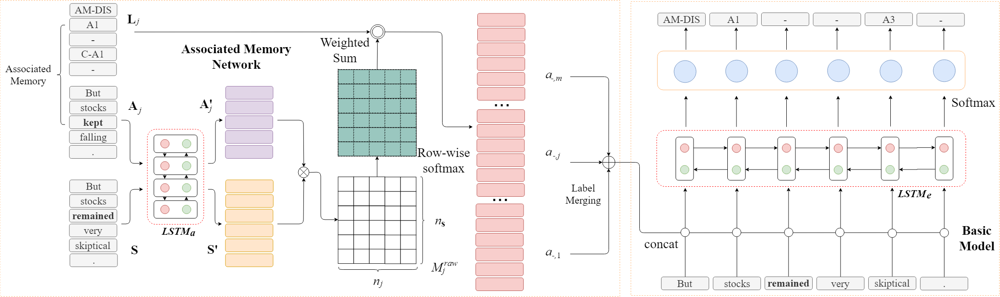
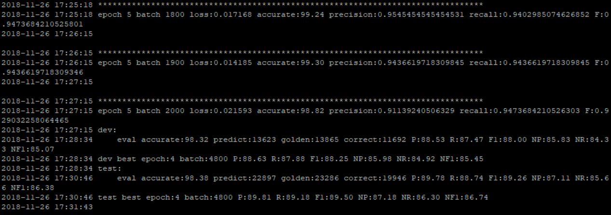

## Usage of AMN SRL

This is the code for paper [semantic role labeling with associated memory network].

Todo list:
- Add explanation of hyper-parameters
- Add the best models we've found
- Add links to paper and citations

### Brief description

We've proposed to use associated memory network to better solve the SRL task. The picture below gives a brief architecture.



### Step.0 Environment

This program needs the following packages to run:

```
Python == 3.6.5
anaconda == 3-5.2.0
PyTorch == 0.4.1
Allennlp == 0.7.1
NumPy == 1.15.4
```

And need to run on Linux.

Please download the ELMo pretrained config and embedding from their website and put them under `models` folder.

Their name should be `elmo_2x4096_512_2048cnn_2xhighway_options.json` and `elmo_2x4096_512_2048cnn_2xhighway_weights.hdf5`.

If you want to use other versions of configs, you need to change some parameters in `final_model.py`.

### Step.1 Preprocessing

Put the train dev test data under `./data` and name them as `train.txt`, `dev.txt`, `test.txt`.

Also put the pretrained 100d glove embedding under `./data`, and name it as `glove.100d.txt`.

Then run:

```
python preprocess.py
```

For preprocessing.

### Step.2 Calculate distance

Put the calculated distance file under `./temp`. 

Name the distance between the preprocressed train and preprocressed train, preprocressed dev, preprocressed test as `train_train.bin`, `train_dev.bin`, `train_test.bin`.

These files should be saved using pickle under write-byte mode.

The object `distance` loaded from these files should be as type: `List[List[Int]]`. Where `distance[i][j]` stands for the idx of j-th nearest sentence in train set w.r.t the i-th sentence in train/dev/test set.

Here we provide the code for *edit distance* method, which performs best among all the distance methods.

run

```
python edit_dis.py train
python edit_dis.py dev
python edit_dis.py test
```

to get train_train.bin, train_dev.bin and train_test.bin

### Step.3 Train the model

First, please specify the hyper-parameters in main.py (or leave them alone for the best performance).

Then run

```
python main.py
```

to train the model. 

After some time, you will get something like below:
